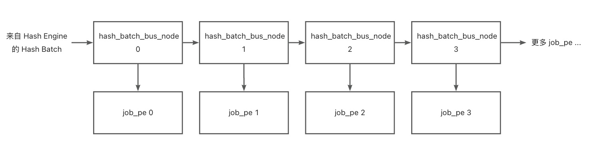
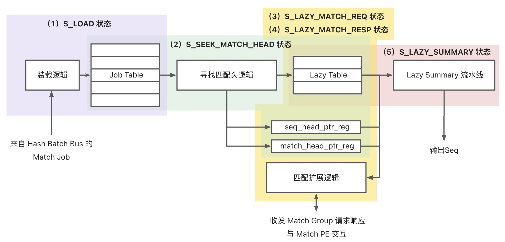

# BeeZip 通用无损数据压缩加速器

## 版本信息

ASPLOS 2024 对应版本在 asplos2024_version 分支上。

# BeeZip 设计文档

## 1. Hash Engine 部分

## 2. Match Engine 部分

### 2.1 Hash Engine 输出到 Job PE 的数据通路

Hash Engine 到 Job PE 之间的数据通路是 Hash Batch Bus

Hash Batch Bus 由一组 hash_batch_bus_node 组成链式结构，与 Job PE 之间的连接关系如下图所示：

hash_batch_bus_node 的功能如下：

- 每个 hash_batch_bus_node 根据输入的 head_addr 可判断出当前 hash batch 是否属于自己处理的范围，如果是，则将数据转发到自己所连接的 Job PE；否则，将数据转发到下一个 hash_batch_bus_node。
- 为了避免组合路径过长，hash_batch_bus_node 具有可配置的 PIPED 参数，当 PIPED > 0 时，hash_batch_bus_node 内会实例化深度为 PIPED 的 FIFO。
- 当 hash_batch_bus_node 内部有 FIFO 时，转发到下一个 hash_batch_bus_node 的数据会先进入 FIFO，然后再从 FIFO 中取出转发到下一个 hash_batch_bus_node，打断组合路径。

### 2.2 Job PE

Job PE 完成 Match Job 内部的串行匹配处理，结构和工作流程图如下：

Job PE 的主体由 Job Table 和 Lazy Table 两个表存储结构，以及表结构周围的控制逻辑组成。

功能描述如下：

- 来自 Hash Batch Bus 的 Match Job 装入 Job Table 中
  - Job Table 刚好容纳一个 Match Job，因此包含 JOB_LEN 个 Job Entry
  - 每个 Job Entry 包含以下字段
    - history_valid：指示该位置是存在有效匹配（大于最小匹配长度且offset合法）
    - history_addr：匹配的历史地址
    - meta_match_len：metaHistory 提供的匹配长度
    - meta_match_can_ext：是否需要继续扩展
    - offset：匹配的偏移量，此处相当于在装载时提前计算了 offset，便于后续使用
  - Job Table 还附带两个寄存器：
    - head_addr：记录当前 match job 起始地址
    - delim：标识当前 match job 是否为猝发的最后一个 job
- Seek Match Head 逻辑寻找 match job 中下一个有效的 Job Entry
  - seq_head_ptr_reg 寄存器指向下一个 seq 起始的地址，相对于 Match Job
  - match_head_ptr_reg 寄存器指向下一个 match 起始的地址，相对于 Match Job
  - 那么 lit_len = match_head_ptr_reg - seq_head_ptr_reg
  - 因此 Seek Match Head 逻辑主要负责更新 match_head_ptr_reg，从 seq_head_ptr_reg 开始移动，直到所指向条目的 history_valid 有效
  - 为了高效查找，支持一次性跳过多个无效条目（8-4-2-1组合）
  - 如果 match_head_ptr_reg 指向了 Job Table 的末尾仍然不能找到有效条目，则认为当前 Match Job 已经处理完毕，输出一个 match_len 为 0 的结果
  - 如果 match_head_ptr_reg 找到了有效条目，则将该条目开始的 LAZY_LEN 个条目装载到 Lazy Table 中
- Lazy Table 包含了 Job Table 中 match_head_ptr_reg 指向的 Job Entry 开始的 LAZY_LEN 个 Job Entry
  - Lazy Table 的结构与 Job Table 稍有不同，每个条目的字段如下：
    - valid：指示条目是否包含有效匹配
    - pending：指示条目是否需要进一步扩展请求
    - idx：当前条目在 Job Table 中的相对索引(该字段目前仅用于调试目的)
    - head_addr：该条目对应匹配起始的地址，装载时已经增加了 metaHistory 偏移
    - history_addr：该条目对应匹配的历史地址，装载时已经增加了 metaHistory 偏移
    - match_len：装载时等于 meta match len，如需扩展则结果累加
    - offset：记录匹配的offset，用于后续 gain 的计算
- Lazy Table 中的条目，如果 valid 且 匹配长度等于 META_LEN，则需要进一步扩展，pending 位为 1
- Lazy Table 中 pending 的条目需要发起 Lazy Match 请求，交给 Match PE 处理，Job PE 通过 match_req_group 和 match_resp_group 通道发起和接受响应
  - 一个 group 请求中包含 LAZY_LEN 个子请求
  - 每个子请求都有一个 router_map 指示其应该被路由到哪个 Match PE
  - 每个子请求都有一个 strb 位标识其是否有效，只有有效的请求需要处理
- 收到来自 match_resp_group 的请求后，Lazy Table 的 match_len 会被更新，得到最终的匹配结果
- lazy_summary_pipeline 对 Lazy Table 中的结果进行汇总，根据 gain 计算规则选出最优的匹配，输出 seq
- 完成 seq 输出后，将更新 seq_head_ptr，判断是否当前 Match Job 已经处理完毕，转向下一个 Match Job 或者继续处理当前 Match Job。

### 2.1 支持非对齐访存的 Window Buffer

### 2.2 Match PE 中的 Scoreboard
#### 2.2.1 数据结构

`scoreboard` 的数据结构保存在以下几个寄存器数组中：

- [`scoreboard_occupied_reg`](src/main/match_engine/match_pe.v)：标记每个条目是否被占用（0-空闲，1-占用）。
- [`scoreboard_wait_reg`](src/main/match_engine/match_pe.v)：标记每个条目是否在等待发送到流水线中（0-空闲或已在流水线中，1-等待发送）。
- [`scoreboard_done_reg`](src/main/match_engine/match_pe.v)：标记每个条目的处理是否完成（0-未完成，1-已完成）。
- [`scoreboard_tag_reg`](src/main/match_engine/match_pe.v)：存储 Job PE 提供的 Tag，用于区分不同的请求。
- [`scoreboard_head_addr_reg`](src/main/match_engine/match_pe.v)：存储匹配开始的头地址。
- [`scoreboard_history_addr_reg`](src/main/match_engine/match_pe.v)：存储匹配开始的历史地址。
- [`scoreboard_match_len_reg`](src/main/match_engine/match_pe.v)：记录匹配长度。
- [`scoreboard_match_contd_reg`](src/main/match_engine/match_pe.v)：跟踪匹配是否连续。

#### 2.2.2 数据结构衍生的状态

- [`first_free_entry`](src/main/match_engine/match_pe.v)：指向第一个空闲条目的索引。
- [`first_done_entry`](src/main/match_engine/match_pe.v)：指向第一个完成条目的索引。
- [`no_free_entry`](src/main/match_engine/match_pe.v)：标记是否没有空闲条目（1-没有空闲条目，0-至少有一个空闲条目）。
- [`has_wait_entry`](src/main/match_engine/match_pe.v)：标记是否有条目在等待（1-至少有一个等待条目，0-没有等待条目）。
- [`has_done_entry`](src/main/match_engine/match_pe.v)：标记是否有条目已完成（1-至少有一个已完成条目，0-没有已完成条目）。

#### 2.2.3 Scoreboard 控制 Match PE 的请求接受和响应发送

  - 接收请求的逻辑：使用no_free_entry状态变量来决定是否可以接收新的匹配请求。如果no_free_entry为假（即存在至少一个空闲条目），则o_match_req_ready信号被置为真，表示Match PE准备好接收新的请求。

  - 发送响应的逻辑：使用has_done_entry状态变量来决定是否有响应可以发送。如果has_done_entry为真（即存在至少一个已完成的条目），则o_match_resp_valid信号被置为真，表示有一个响应准备好发送。同时，使用first_done_entry索引来从scoreboard中获取对应的job_pe_id、tag和match_len信息，作为响应的一部分发送出去。

#### 2.2.4 条目占用状态的更新

  - 复位后，所有条目均处于未占用状态
  - 如果一个条目当前未被占用，并且有一个匹配请求（[`i_match_req_valid`](src/main/match_engine/match_pe.v)为真），则根据以下条件更新该条目的占用状态：
      - 如果该条目是下一个要发射的条目（[`next_issue_entry`](src/main/match_engine/match_pe.v)），则将其标记为占用。
      - 如果下一个要发射的条目已被占用，且当前条目是第一个空闲的条目（[`first_free_entry`](src/main/match_engine/match_pe.v)），则也将其标记为占用。
  - 如果一个条目当前被占用，并且满足以下条件，则将其释放：
      - 该条目是第一个完成的条目（[`first_done_entry`](src/main/match_engine/match_pe.v)），并且有一个匹配响应准备好（[`i_match_resp_ready`](src/main/match_engine/match_pe.v)为真）。

#### 2.2.5 条目等待状态的更新

- 复位时，所有`scoreboard`中的等待状态寄存器被清零。

- 设置等待状态：
  - 刚刚进入 Match PE 的请求所在的条目在设置 occupied 状态的同时也设置处于 wait 状态
  - 处于 occupied 状态，且不处于 wait 状态的条目，如果收到了流水线上返回的结果，并且该结果指示还需要再次进行匹配扩展，则设置为 wait 状态

- 清除等待状态
   - 处于 occupied 状态，且处于 wait 状态的条目，如果正好作为 issue_entry_reg 指向的条目，在连续多个请求发射完成时（burst_addr_bias_reg == MAX_BURST_ADDR_BIAS） 清除 wait 状态

#### 2.2.6 条目完成状态的更新

- 完成条件：对于每个scoreboard条目，如果当前条目未完成（~scoreboard_done_reg[i]），并且满足以下条件，则将该条目标记为完成（scoreboard_done_reg[i] <= 1'b1）：
  - 流水线输出有效（pipeline_o_valid）且是最后一个输出（pipeline_o_last）。
  - 流水线输出的索引与当前条目匹配（pipeline_o_idx == i[SCOREBOARD_ENTRY_INDEX-1:0]）。
  - 如果当前条目的匹配不连续（~scoreboard_match_contd_reg[i]），或者流水线的匹配长度小于预定义宽度（pipeline_o_match_len < MATCH_PE_WIDTH），或者当前条目的匹配长度加上流水线的匹配长度达到或超过了最大匹配长度（scoreboard_match_len_reg[i] + pipeline_o_match_len >= MAX_MATCH_LEN）

- 如果一个条目已经标记为完成（scoreboard_done_reg[i]），并且它是第一个完成的条目（i[SCOREBOARD_ENTRY_INDEX-1:0] == first_done_entry），在匹配响应已经准备好（i_match_resp_ready）的情况下，将该条目的完成标记清除（scoreboard_done_reg[i] <= 1'b0），以便重新使用。

#### 2.2.7 条目数据的更新

- 新条目的插入：当检测到一个`scoreboard`条目未被占用（`~scoreboard_occupied_reg[i]`），并且该条目是第一个空闲的条目时（`first_free_entry == i[SCOREBOARD_ENTRY_INDEX-1:0]`），如果有一个有效的匹配请求（`i_match_req_valid`），则将该请求的相关信息写入到当前的`scoreboard`条目中。这包括请求的头地址、历史地址、作业ID、标签，同时将匹配长度初始化为0，并设置匹配的连续性标志为1。

- 对于已被占用且未完成的`scoreboard`条目（`scoreboard_occupied_reg[i] && ~scoreboard_done_reg[i]`），如果流水线输出有效（`pipeline_o_valid`）且输出的索引与当前条目匹配（`pipeline_o_idx == i[SCOREBOARD_ENTRY_INDEX-1:0]`），则根据以下条件更新条目：
  - 如果当前条目可以延续之前的匹配（[`scoreboard_match_contd_reg[i]`](src/main/match_engine/match_pe.v)为真），则更新匹配长度（[`scoreboard_match_len_reg[i]`](src/main/match_engine/match_pe.v)）。
  - 如果当前输出是猝发中的最后一个结果（[`pipeline_o_last`](src/main/match_engine/match_pe.v)为真），则更新头地址和历史地址，以准备好接收下一轮的猝发请求。这里假设地址不会饱和，因为如果不饱和，结果就直接输出了。
  - 如果当前输出的匹配长度不等于预定义的宽度（`pipeline_o_match_len != `MATCH_PE_WIDTH`），则将匹配的连续性标志设置为0，表示后续的匹配结果将被丢弃。

#### 2.2.8 匹配请求到响应的状态转换

- **当匹配请求到达 Match PE 时**：
  - 匹配处理单元（Match PE）接收到匹配请求，并检查`scoreboard`中是否有空闲条目来存储此请求的信息。如果有空闲条目，请求的信息（包括头地址、历史地址、作业ID、标签等）被记录在`scoreboard`中，同时初始化匹配长度为0，并设置匹配的连续性标志为1。

- **匹配请求发送到流水线**：
  - 在 burst_addr_bias_reg 控制下，向流水线发送地址连续的请求。

- **当流水线输出匹配结果时**：
  - 流水线完成匹配操作后，会输出匹配结果。此时，`scoreboard`中相应的条目会根据输出结果进行更新：
    - 如果存在连续的匹配，匹配长度会被更新。
    - 如果当前输出是猝发中的最后一个结果，头地址和历史地址会被更新，以准备接收下一轮的猝发请求。
    - 如果匹配长度不符合预定义宽度，匹配的连续性标志会被设置为0，表示后续的匹配结果将被丢弃。

- **当匹配响应发出时**：
  - 一旦所有相关的匹配操作完成，并且`scoreboard`中的条目被相应地更新，匹配响应会被发出。这可能包括匹配成功的确认、匹配的具体细节（如匹配长度和匹配的数据），以及任何必要的后续操作指示。此时，相应的`scoreboard`条目可能会被标记为完成，以便为后续的匹配请求释放空间。